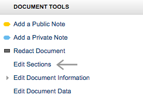
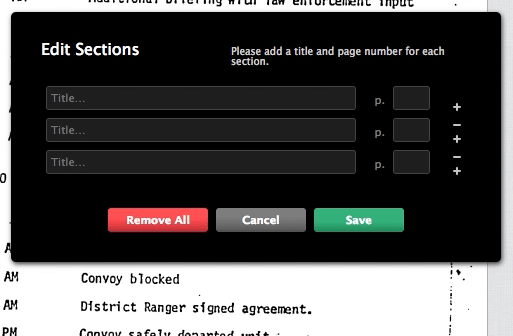
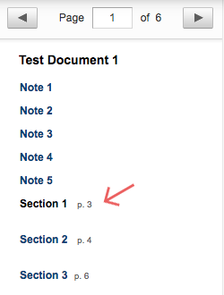

# Adding Sections for Navigation
To help differentiate portions of a long document, you can add **navigation links** to the sidebar by **defining sections.**

#### To Add Sections to a Document:

1. Locate **“Document Tools”** on the right-hand sidebar of the document workspace.
2. Select **"Edit Sections"**.

    

3. In the dialog box, input the **title** for each section you want to create, as well as the starting **page number** for that section.
4. Use the **plus and minus icons** to add and remove rows.
    
5. Select **"Save"**.
6. Your sections will appear in the **left-hand sidebar**, as below. Simply click on the name of the section you want to navigate to.

    

