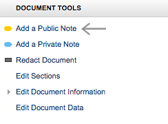
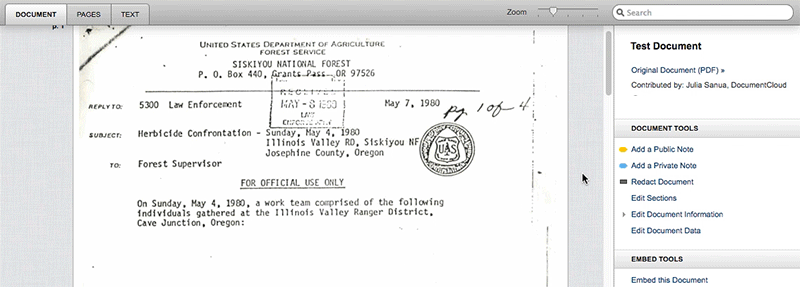
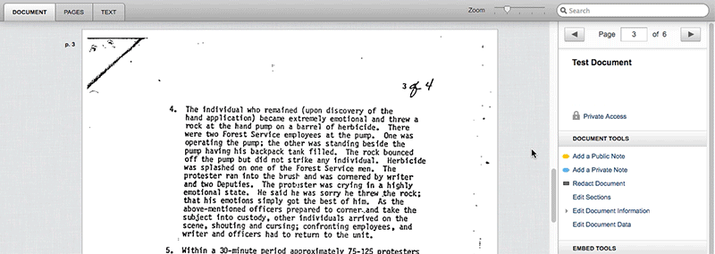
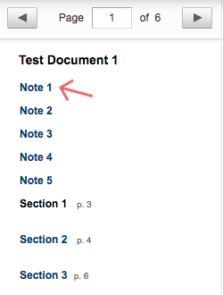
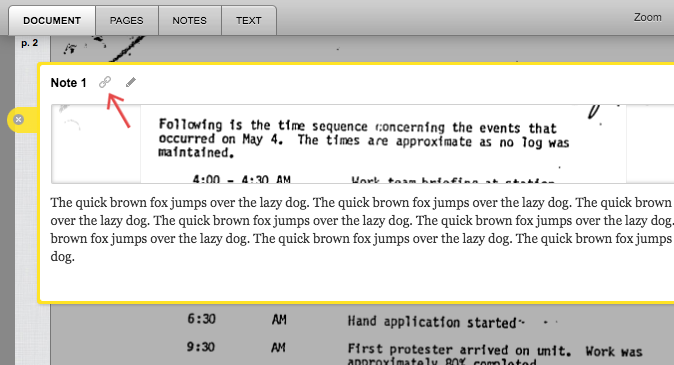
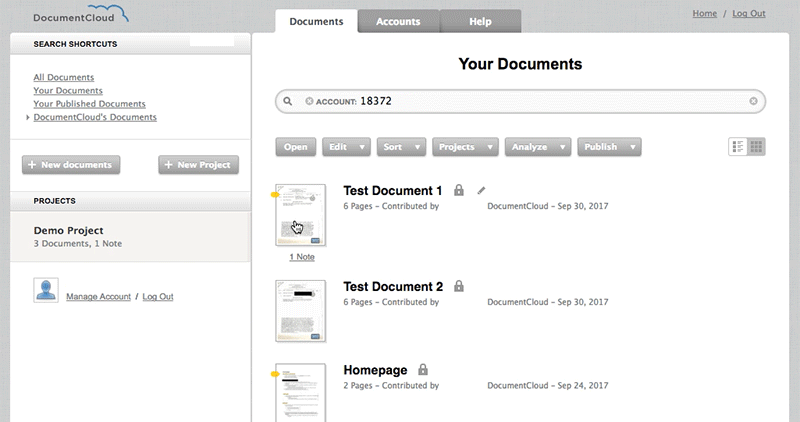
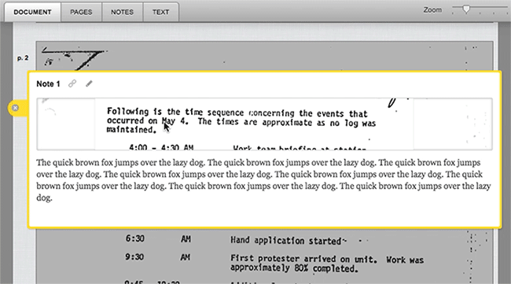

# Annotate Documents: Public, Private, and Draft Notes

DocumentCloud supports both private and public notes. **Public notes** are visible to anyone who has access to the document. **Private notes** are only ever visible to their author. 

Public notes may also be saved as **drafts**. Draft notes are visible to anyone with the privileges necessary to annotate a document, including reviewers and collaborators, but they won't be published with the document.

**In this article:**
* Add a note to a specific section of a page
* Add a note to an entire page
* Link to a specific note you've made
* Print your notes
* Delete your notes
* Add markup to notes

## How to Annotate Documents

#### Add a Note to a Specific Section of a Page

1. Locate **“Document Tools”** on the right-hand sidebar of the document workspace.
2. Select **“Add a Public Note”** or **“Add a Private Note”**. 

    
3. When you mouse over pages in your document, your cursor will change into crosshairs. **Click and drag** over the area of the document you want to annotate.

    
4. Title and add commentary to the note as you wish.

#### Add a Note to an Entire Page

1. Select **“Add a Public Note”** or **“Add a Private Note”**.
2. When you mouse in between two pages of your document, you will see a **dotted line**. Click to add a full-page annotation tagged to the lower page.

    
    
Once you add notes to your document, **all notes and their titles will appear in the sidebar** as below. **Click** the title of a note anywhere in your document to open it.
    

## Linking to Notes
When sharing a document with others, you can **link directly to specific notes you have made** instead of the document as a whole. To do this, you must create a permalink for the note in question.

#### To Create a Note Permalink:

1. Open a note.
2. Click the **link icon** located beside the note title. 

    
3. **Your browser's address bar will be updated to display the full URL of the annotation.**
 * The good stuff comes after the # symbol — in our example the URL of the embedded document ends with #document/p173/a8646, so we know that the annotation is on page 173.
4. **Copy the url** and share. 

[NOTE]You also can embed a note directly. See our publishing and embedding documentation [LINK] for details.[/NOTE]

## Printing Notes
It's easy to print out all the notes on a particular document or collection of documents. 

#### To Print Notes:

1. Navigate to the **"Your Documents"** page.
2. Select the documents you want to print. A blue line should appear around the document icon(s).
3. Select **"Publish"**. Select **"Print Notes"** from the dropdown.

    
4. Use your **browser or system dialog** to print.

## Deleting Notes

#### To Delete a Note:

1. **Open the note** by clicking on it.
2. Select the **pencil icon** at the top of the note to ender edit mode.
3. Select the **"Delete"** button to remove the note.

    

[NOTE]Deleting a note cannot be undone, so proceed with caution.[/NOTE]

## Advanced

#### Markup and HTML in Notes

Note bodies can contain a limited subset of HTML and attributes. **The table below lists some commonly used elements and attributes.** You can find a full list beneath the table.

|                 |                                                                                      |                                            | 
|-----------------|--------------------------------------------------------------------------------------|--------------------------------------------| 
| ELEMENT         | DESCRIPTION                                                                          | ATTRIBUTES                                 | 
| `<a>`           | creates a hyperlink                                                                  | href                                       | 
| ``         | displays an image                                                                    | src, width, height, alt, align             | 
| ` `         | inserts a line break                                                                 | –                                          | 
| `<em>, <i>`     | emphasizes/italicizes text                                                           | –                                          | 
| `<strong>, <b>` | bolds text                                                                           | –                                          | 
| `<u>`           | underlines text                                                                      | –                                          | 
| `<blockquote>`  | offsets text as a quote                                                              | –                                          | 
| `<table>`       | creates a table into which rows (tr elements) are inserted                           | summary, width                             | 
| `<tr>`          | creates a table row to hold table data (td elements) and table headers (th elements) | –                                          | 
| `<th>`          | creates a table header cell                                                          | abbr, axis, colspan, rowspan, width, scope | 
| `<td>`          | creates a table cell in a "tr"" row                                                  | abbr, axis, colspan, rowspan, width        | 
| `<ol>`          | creates a numbered ordered list                                                      | start, reversed, type                      | 
| `<ul>`          | creates is a bulleted unordered list                                                 | type                                       | 
| `<iframe>`      | An iframe can be used to embed web pages.                                            | src, srcdoc, width, height, sandbox        | 
