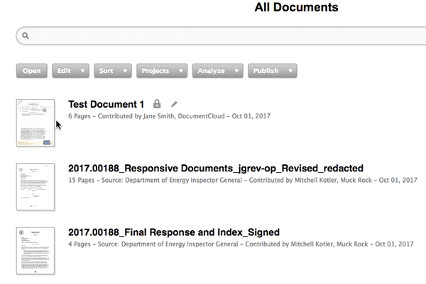
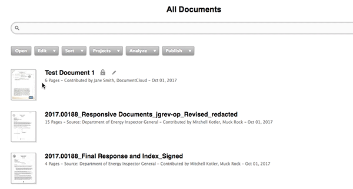
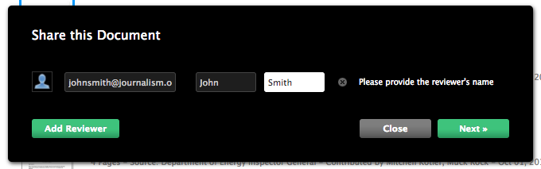
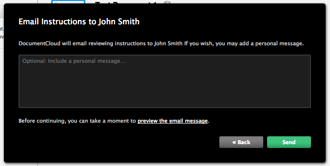
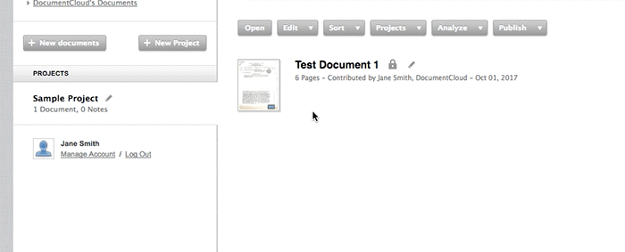

# Collaboration and Sharing

In DocumentCloud, you can **share your documents with your newsroom**. You also can **share entire projects with other users**, whether or not they're in your newsroom, and **share specific documents with reviewers**, whether or not they have a DocumentCloud account.

**In this article:**
* Change the access level of a document
* Share documents with reviewers without DocumentCloud accounts
* Add collaborators on DocumentCloud to a project

## Sharing Documents with Your Newsroom
When you upload a document, you can decide whether or not you're ready to make it public. By default, no one but you will be able to see documents you've uploaded to DocumentCloud. 

#### To change the access level of your documents:

1. Right-click the document icon.
2. Select **“Set Access Level”**.

* **Public Access** - Anyone, even those without DocumentCloud accounts, may access the document.
* **Private Access** - The default. Only you can access the document.
* **Private to DocumentCloud** - Only people in your organization may access the document. 

 
## Sharing Documents with Reviewers
**You can share specific documents for review with anyone with an email address, no DocumentCloud account required.** This is useful for crowdsourcing your document annotations among experts, or quickly sharing a document on deadline.

#### To share a document with a reviewer:

1. **Select the document you would like to share.** A blue line should appear around the document icon.
2. Select **“Analyze”**.
3. Select **“Share this Document”**.

4. Input the email address and name of the person you would like to share the document with. Click **“next”**.

5. You will be prompted to include an optional short message.

6. Click **“send”**. DocumentCloud will email a link to your document and reviewing instructions to that person’s email.

## Adding collaborators to a project
**Adding a collaborator to a project gives them access to view and edit all of the documents in that project and all the public notes on those documents.** Your private notes will still be private. Once you add a collaborator a project, the project will appear in their account sidebar for easy access.

#### To to add a collaborator to a project:

1. **Hover** over a project.
2. Select the **pencil icon** beside the project name.
3. Click **“Add a collaborator to this project”**.

4. Input the email address of the person you're adding as a collaborator. Click **"Add"**.
5. The project will appear in the **account sidebar** of your collaborator; they may access it from there.

[NOTE]Collaborators must have a DocumentCloud account. If you try and add someone as a collaborator with an email address that is not associated with an already-existing DocumentCloud account, you will receive an error.[/NOTE]

