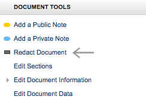
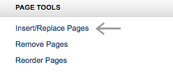
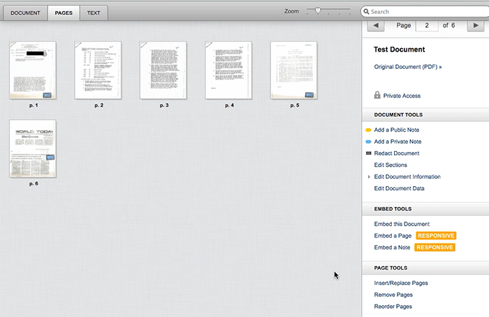
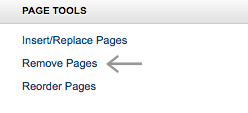
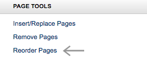
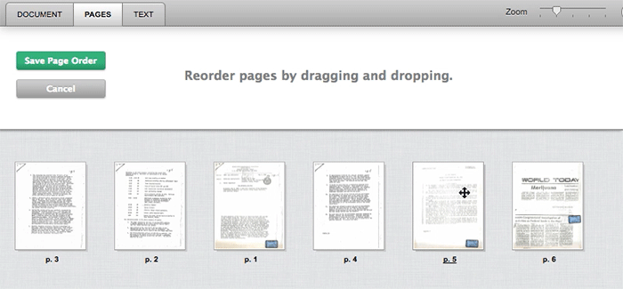
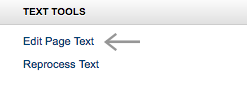
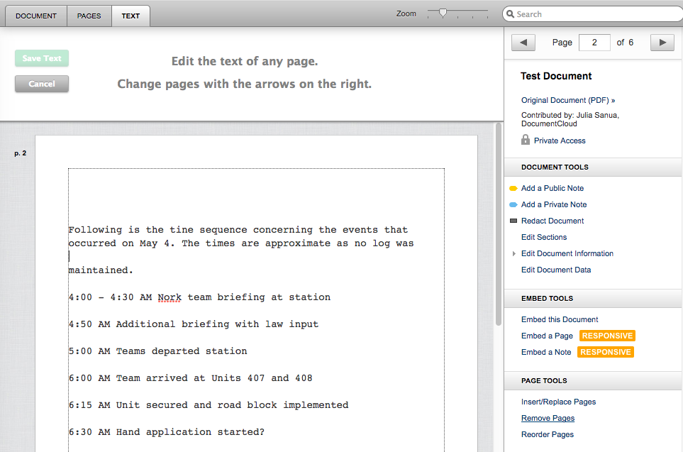
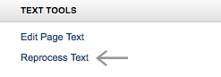

# Document Modification
**We don't tend to think of modifying source documents as something a responsible journalist would do, but there are absolutely times when you need to.**

Whether you're trying to protect the privacy of a minor by redacting personally identifying information from a foster care incident report, reorganizing a collection of letters or inserting a page that wasn't properly scanned, journalists sometimes need to rework source documents to ready them for publication. 

**In this article:**
* Redact portions of documents
* Insert, remove, and replace pages
* Clean up OCR text

## Redacting Documents
Not everything is appropriate for publication. Reports from a state foster care agency [LINK] might illustrate a story well, but such documents are also usually full of sensitive information like the full names of minors or other personally identifying information. We expect newsrooms to use their own policies and judgement in determining what is and is not suitable for publication.

#### To Redact a Portion of a Document:

1. Select **“Redact Document”** from the sidebar under **“Document Tools”**.
    
2. Click and drag a black rectangle over the text you would like to remove.
    
3. Select **“Save Redaction”** and then **“Okay”**. 
4. You will be forwarded back to the **“Your Documents”** page. Once your document is finished processing, the text you selected has been blacked out.

[NOTE]**Redactions are permanent, and cannot be undone.** When you redact a portion of a document, all of the text touching the black box will additionally be removed from the OCR text in the **"text"** tab. No trace of it will be left in the document file.[/NOTE]

## Page Tools

Within the pages tab of any document that you have permission to edit, you'll find page manipulation tools in the sidebar on the right. As you save changes, the document window will close so DocumentCloud can rebuild your document.

Depending on the size of the document and the number of other jobs DocumentCloud is handling, this can take a while. Any changes to a document will also be applied to the original PDF file.

#### To Insert/Replace a Page:

1. Navigate to the **“Pages”** tab in the document workspace.
2. Select **“Insert/Replace Pages”** under **“Page Tools”**.
    
    * **To replace a page**, select any single page.
    * **To replace an entire section of the document**, hold down the shift key and select multiple pages.
    * **To insert new pages into the document**, select the space between the two pages where you’d like to insert your new pages.

6. When you’re ready to proceed, click the **“Upload Pages”** button to choose a file from your computer to replace the chosen pages or insert a new page into your document.

#### To Remove a Page:

1. Navigate to the **“Pages”** tab in the document workspace.
2. Select **“Remove Pages”** under **“Page Tools”**.

    
3. Select all the pages you want to remove.
4. When you’re ready to proceed, click the **“Remove Pages”** button.

#### To Reorganize a Document:

1. Navigate to the **“Pages”** tab in the document workspace.
2. Select **“Reorder Pages”** under **“Page Tools”**.

    
3. Select all the pages you want to remove.
3. Drag and drop pages to change their position in the document.
    

## Cleaning up OCR Text

Need to clean up OCR gibberish? Edit the text that appears in DocumentCloud's text tab with the Edit Page Text option. 

#### To Manually Edit OCR Text:

1. Select **“Edit Page Text”** from the sidebar under **“Text Tools”**.
    
2. You can freely edit, delete, or add text. 
3. Use the back and forward arrows at the top of the sidebar to page through your document. (If you do not see the back and forward arrows, try scrolling up the sidebar.)
4. When finished, click the **"Save Text"** button. DocumentCloud will store your changes and update the search index and entity list for that document. 

[NOTE] To undo edits you’ve made to a page, hover over the page preview in the top activity tray and click the **(x)** icon in the bottom left corner.[/NOTE]

[NOTE]Changes made with Edit Page Text will NOT alter the original PDF.[/NOTE]

#### To Reprocess OCR Text:

As we work, DocumentCloud is continually improving the tools we provide to users. If we improve the quality of our OCR [LINK] tools, you can try processing an old document anew for better results. 

1. Select “Reprocess Text from the sidebar under **“Text Tools”**. 
    
2. Click **“Reprocess”**.

[NOTE]By default, DocumentCloud tries to use the text content embedded in the PDF file, if available. If you know that this text is incorrect, and you would prefer to have DocumentCloud use Tesseract to extract the text via optical character recognition, choose the **"Force OCR"** option.[/NOTE]

