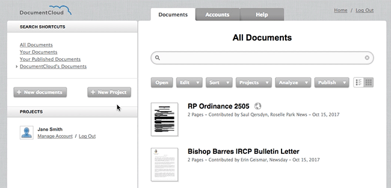
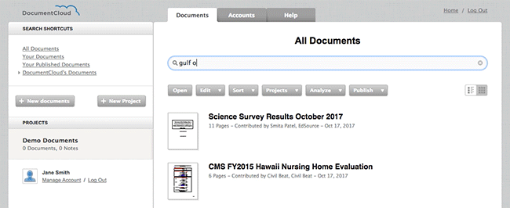
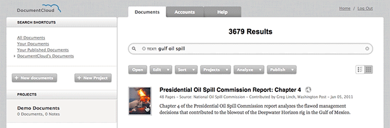
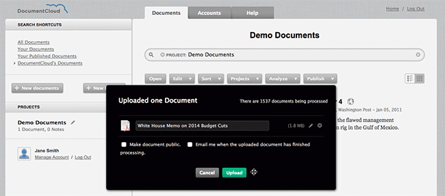
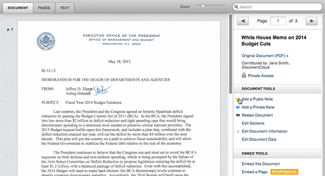
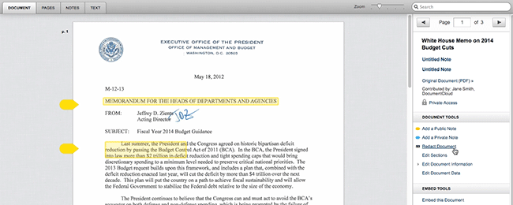

# Guided Tour

#### DocumentCloud is...
* A tool for organizing and working with large documents and document collections
* A document viewer that makes it easier for reporters to share source material with readers
* A publicly accessible repository of primary source documents that were used in journalists' investigations

If you're new to DocumentCloud, here's a **walkthrough** to help you get your bearings.
***

#### Log in.

Use the link

#### Create your first project.

Use the **"New Project"** button to the left of the homepage to create a project called **"Demo Documents."** Projects keep documents organized, allow you to restrict your searches to a limited group of documents and make it possible to collaborate on documents with other journalists.

#### Try a search of public documents.

Search for **"gulf oil spill"**[LINK].

This will search all documents made public by any DocumentCloud user for any with "gulf," "oil" and "spill" in the text or title. Your results should include a number of documents relating to the British Petroleum oil spill in the Gulf of Mexico. 

Click and drag the preview icon of one or two of these documents into your **"Demo Documents"** project. 

Then, click on **"Demo Documents"** to open your project. You should see your documents listed there.

**—> Learn more about DocumentCloud search...**

#### Upload a document.

Although you can find a many useful primary source documents through DocumentCloud's search function, you'll eventually want to start uploading and annotating your own documents.

Select the **"New Document"** button from the homepage sidebar. This will open up a system dialog where you can select one or more documents to upload.
    

You can also **click and drag** a document from a folder on your computer into the DocumentCloud interface.

**—> Learn more about uploading documents...**

#### Make some annotations.

Open your document by double-clicking on the document thumbnail. Select **"Add a Public Note"** or **"Add a Private Note"**. Then, **click and drag** over the portion of the document you'd like to annotate. You can title and add a description to your annotation as well.

#### Redact text from your document.

If your document has sensitive information, you may redact that information using DocumentCloud as well.

Select **"Redact Document"** from the right-hand sidebar. Then, click and drag over the area of the document you want to redact, and click **"Save"**. After the document has finished re-processing, the redacted text will have been completely removed.

#### Share your document with a colleague.

DocumentCloud contains advanced features allowing journalists to change the access level of their documents and share document and projects with people inside and outside their newsrooms.

**—> Learn more about uploading documents...**

#### Embed your document.
#### Try our analytic tools.
#### Explore our API.

