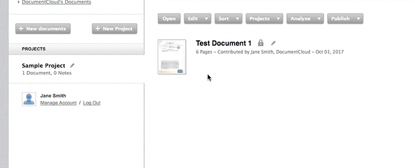

# Guided Tour

#### DocumentCloud is...
* A tool for organizing and working with large documents and document collections
* A collaboration tool, allowing journalists to share documents with professionals inside and outside their newsroom
* A document viewer that makes it easier for reporters to share source material with readers
* A publicly accessible repository of primary source documents 

**If you're new to DocumentCloud, here's a walkthrough to help you get your bearings.**
***

### 1) Log in.

Once you've been added to your organization's DocumentCloud account, you should receive an email welcoming you to the site. Click through the email and log into your personal account.

### 2) Create your first project.

Use the **"New Project"** button on the left of the homepage to create a project called **"Demo Documents."** Projects keep documents organized, allow you to restrict your searches to a limited group of documents and make it possible to collaborate on documents with other journalists.

### 3) Try a search of public documents.

Search for **"gulf oil spill"**.

This will search all public documents on DocumentCloud for the keywords "gulf," "oil" and "spill". Your results should include a number of documents relating to the British Petroleum oil spill in the Gulf of Mexico. 

Click and drag the preview icon of one or two of these documents into your **"Demo Documents"** project. 

Then, click on **"Demo Documents"** to open your project. You should see the documents you've just dragged into the project in a list.

### 4) Upload a document.

Although you can find many useful primary source documents through DocumentCloud's search function, you'll eventually want to start uploading and annotating your own documents.

Select the **"New Document"** button from the homepage sidebar. This will open up a system dialog where you can select one or more documents from your computer to upload.

You can also **click and drag** a document from a folder on your computer into the DocumentCloud interface to upload.

### 5) Make some annotations.

Open your document by double-clicking on the document thumbnail. Select **"Add a Public Note"** or **"Add a Private Note"**. Then, **click and drag** over the portion of the document you'd like to annotate. You can title and add a description to your annotation as well.

### 6) Redact text from your document.

If your document has sensitive information, you may redact that information using DocumentCloud as well.

Select **"Redact Document"** from the right-hand sidebar. Then, click and drag over the area of the document you want to redact, and click **"Save"**. After the document has finished re-processing, the redacted text will have been completely removed.

### 7) Share your project with a colleague.

DocumentCloud contains advanced features allowing journalists to change the access level of their documents and share documents and projects with people inside and outside their newsrooms.

Hover over **"Demo Documents"**, and select the **pencil icon** beside the project name. Select **"Add a collaborator to this project"**. Then, input the email address of someone you work with to add them as a collaborator.

Once you've clicked save, the project and all the documents contained within will appear in the account sidebar of your collaborator.

NOTE: **Collaborators must have a DocumentCloud account.** If you try and add someone as a collaborator with an email address that is not associated with an already-existing DocumentCloud account, you will receive an error. [Click here](collaboration.md#sharing-documents-with-reviewers) for more information on how to share private documents with reviewers who do not have DocumentCloud accounts.

### 8) Generate an embed code for your document.
DocumentCloud makes it easy for you to share primary source documents with readers online to supplement and provide context for your published work.

Select one of the documents you've just uploaded. Then, select **"Publish"** from the top menu bar, and click **"Embed Document Viewer"**. If the document is not yet set to public, you'll have to [make it public](publishing_embedding.md#making-documents-public) in order to embed it.

Click through the dialogue. You'll be given a bunch of **different options to customize your document viewer**, including the height you'd like to set it to and whether or not you want the sidebar to show up. You can **preview the document viewer** as well to see how it will look when published.

Once you're done, simply **copy and paste** the embed code into the body of your article. If you use Wordpress, you can download our [Wordpress plugin](https://wordpress.org/plugins/documentcloud/). This will let you embed DocumentCloud documents into content with Wordpress shortcode instead.

