# Publishing and Embedding
**Ready to share your documents with readers?** Either by embedding our custom viewer or using oEmbed, you can publish individual documents, embed a set of documents that readers can browse, or embed a single page or note from any document.

## Making Documents Public

Before you publish a document, page, note or document set, you'll want to make sure that the document or documents are public. You either **change the access level of the document** to make it available to the public immediately, or **set an automatic publication date**.

#### To Change a Document's Access Level:

1. Navigate to **"Your Documents"** and right click on the thumbnail of the document you would like to make public.
2. Select **"Set Access Level"** and switch the setting to **"Public Access"**.         

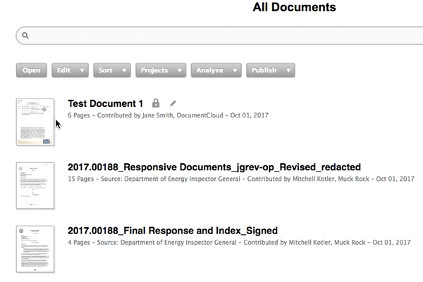

#### To Set a Publication Date: 

1. Navigate to **"Your Documents"** and select the document you want to make public.
2. Click **"Publish"**.
3. Click **"Set Publication Date"**.            
    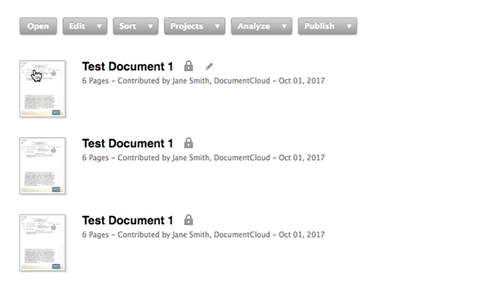
4. Select the date you'd like the document to be made public in the dialog box and click **"Save"**. 
5. Your document will now automatically be made public on that date and time.

NOTE: DocumentCloud syncs to the local time on your computer. For example, if your computer is set in Eastern Standard Time, whatever publication date and time you select will also by default be in Eastern Standard Time.

## Linking to a Document, Page, or Note

The most simple way to share your work in DocumentCloud with readers is to **publish a URL to a document.** You can modify the URL to have the document open to a specific page or note. Follow these URL formats:

**Full document:**

`https://www.documentcloud.org/documents/282753-lefler-thesis.html`

**Document open to a specific page:**

`https://www.documentcloud.org/documents/282753-lefler-thesis.html#document/p22)`

**Document open to a specific note:**

`https://www.documentcloud.org/documents/282753-lefler-thesis.html#document/p57/a42283`

Click [here](annotate_documents.md/#linking-to-notes) for more information on how to share a url linking to a specific note.

# Embedding Documents

You have a few different options when it comes to embedding your DocumentCloud documents on a website.

## Full Document Embed

**Good for:** Allowing your readers to browse a multi-page document. If you have annotated the document, readers can click through your annotations in an interactive format just as you can in the DocumentCloud workspace.

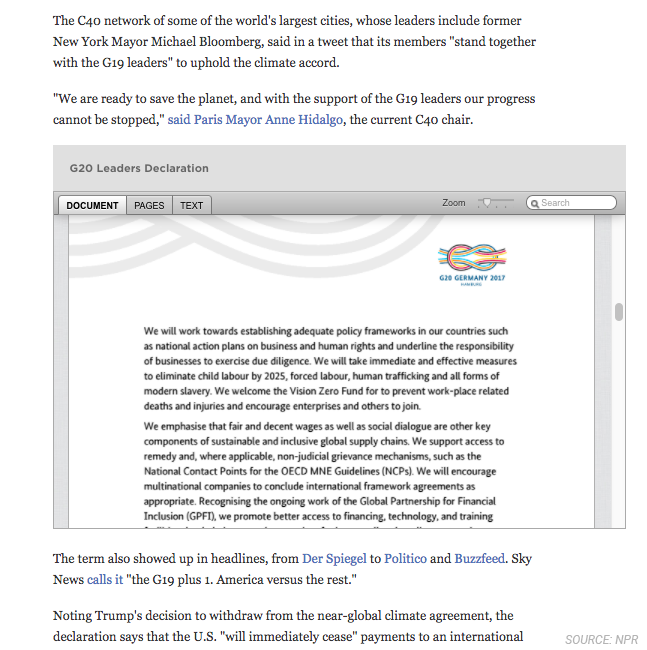

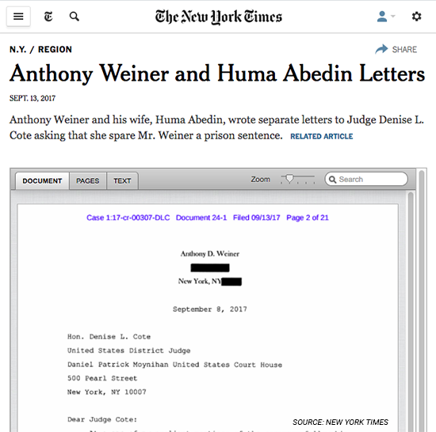

*** 

## Single Page Embed 

**Good for:** Sharing single-page documents with readers.

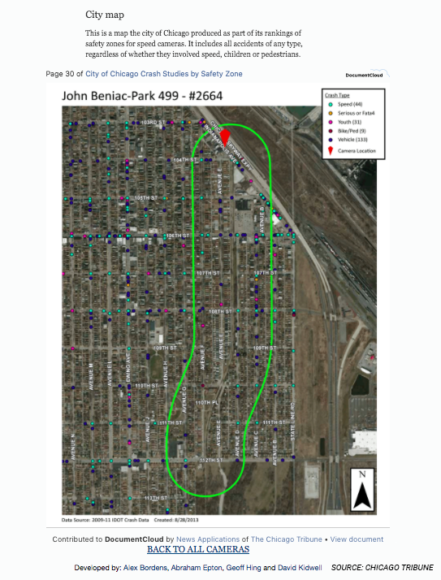

*** 

## Note Embed

**Good for:** Folding small sections of primary source documents into your published story. 

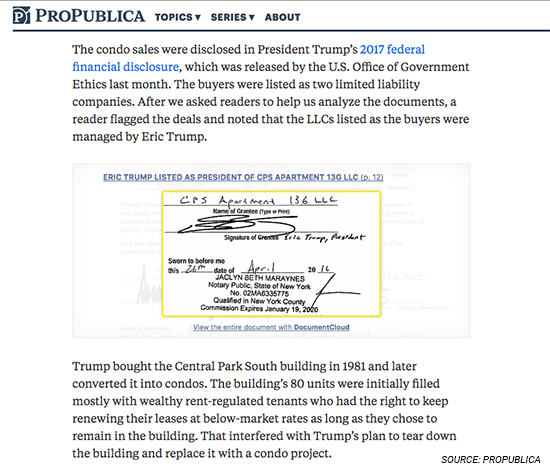

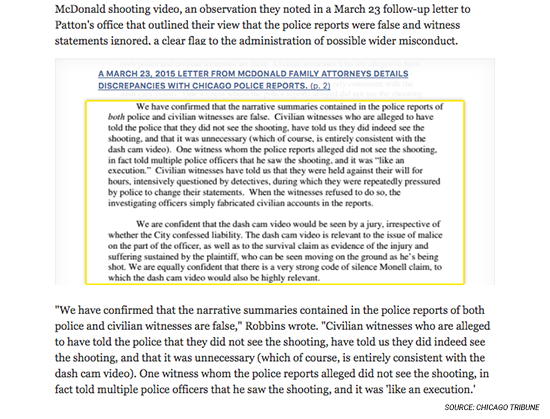

*** 

## Document List Embed

**Good for:**Sharing an entire collection of documents pertinent to a story or investigation with readers. 

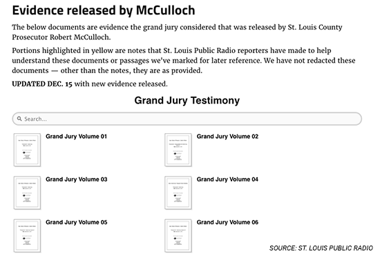

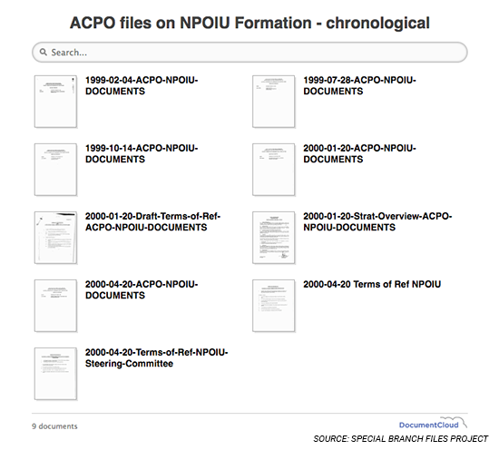

*** 

## How to Embed Documents

#### Preparing to Embed a Document

Before you embed a document on your site, we encourage you to fill in a couple of additional pieces of information about the document. Open the document to take one more look over the document's **title**, **description**, **source**, and **public notes**. If everything is as you like it, you're ready to continue.

To access embed options, select the document you want to embed and click on **"Publish"** in the toolbar.

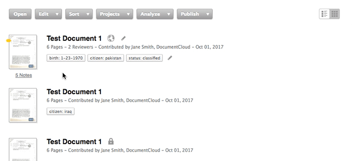

### Embed Full Document Viewer
##### 1) Select "Embed Document Viewer" from the "Publish" dropdown

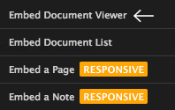

##### 2) Review Document
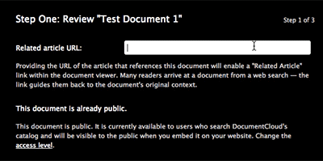

* First, you may provide the link to the article referencing the document to enable a **"Related Article"** link within the document viewer. (This guides readers who stumble across the document from a web search to the article's original context.)

* You will be alerted if your document needs to be made public.

##### 3) Configure the Document Viewer
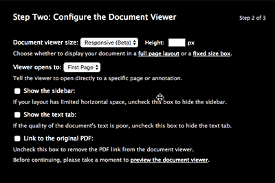

You can control all of the below to customize how your document viewer embed appears:
* The size of the document viewer (full page layout, fixed size box)
* Which page the document opens to by default
* Show/hide the sidebar
* Show/hide the text tab
* Whether or not to link to the original PDF (allowing your readers to download the document)

##### 4) Copy and Paste the Embed Code
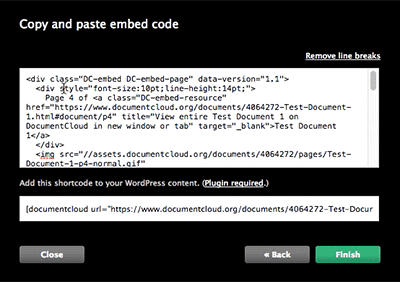

* DocumentCloud will generate two pieces of code: an **HTML embed code**, and a **Wordpress shortcode**. 
* Simply **copy and paste** the HTML code to a page on your site. If you have the [DocumentCloud Wordpress plugin](https://wordpress.org/plugins/documentcloud) installed, paste it into the body of your article.

### Embed a Single Page from a Document
##### 1) Select "Embed a Page" from the "Publish" dropdown

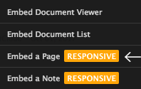

##### 2) Select a Page to Embed
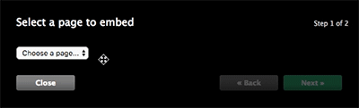
##### 3) Copy and Paste the Embed Code

* DocumentCloud will generate two pieces of code: an **HTML embed code**, and a **Wordpress shortcode**. 
* Simply **copy and paste** the HTML code to a page on your site. If you have the [DocumentCloud Wordpress plugin](https://wordpress.org/plugins/documentcloud) installed, paste it into the body of your article.

### Embed a Note from a Document
##### 1) Select "Embed a Note" from the "Publish" dropdown
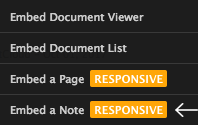
##### 2) Select a Note to Embed
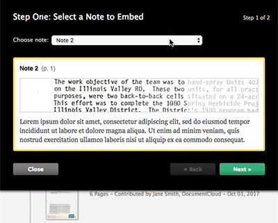
##### 3) Copy and Paste the Embed Code

* DocumentCloud will generate two pieces of code: an **HTML embed code**, and a **Wordpress shortcode**. 
* Simply **copy and paste** the HTML code to a page on your site. If you have the [DocumentCloud Wordpress plugin](https://wordpress.org/plugins/documentcloud) installed, paste it into the body of your article.

### Embed a List of Documents
##### 1) Select "Embed Document List" from the "Publish" dropdown
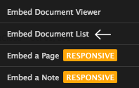
##### 2) Configure the Embedded Documents
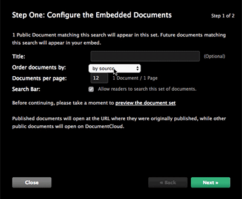

You can control all of the below to customize how your document list embed appears:
* The title of your document list
* The order your documents appear in
* How many documents thumbnails are shown per page
* Enable/disable the search bar

##### 3) Copy and Paste the Embed Code

* DocumentCloud will generate two pieces of code: an **HTML embed code**, and a **Wordpress shortcode**. 
* Simply **copy and paste** the HTML code to a page on your site. If you have the [DocumentCloud Wordpress plugin](https://wordpress.org/plugins/documentcloud) installed, paste it into the body of your article.

## Wordpress Shortcodes
Users who publish via WordPress can install a **Wordpress plugin** that lets you embed DocumentCloud resources using shortcodes.

#### How to embed documents using Wordpress shortcodes
1. **Download** the [DocumentCloud Wordpress plugin](https://wordpress.org/plugins/documentcloud).
    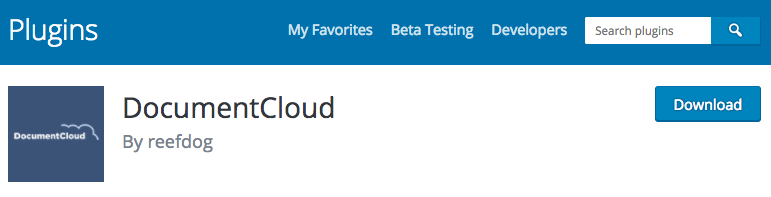
2. **Install and activate** it according to the directions.
3. During the last step of the embed preparation process on DocumentCloud, you will be given both a regular embed code and a Wordpress embed code.
    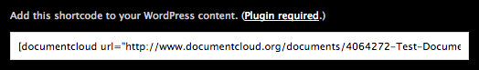
4. **Copy and paste** the Wordpress embed code into the body of your Wordpress article.

#### Customizing Wordpress embeds
You also can pass additional parameters to control the size and attributes of the embed.

* **To set the embed to a particular width**, add [ `width=____px` ] to the end of the embed code.

    * `~/documents/282753-lefler-thesis.html" width="800"]`

* **To have the embed pre-scroll to a particular page**, add [ `page="__"` ] to the end of the embed code.
    * `~/documents/282753-lefler-thesis.html" page="3"]`

* **For a page, use any page-specific URL:**
    * `~/282753-lefler-thesis.html#document/p22"]`

* **For a note, use any note-specific URL:**
    * `~/documents/282753-lefler-thesis.html#document/p1/a53674"]`

NOTE: If you don't indicate a width (or manually disable responsive widths with `responsive="false"`), then the document will automatically narrow and widen to fill available width.

## oEmbed Service

[**oEmbed**](https://oembed.com) is a Web standard for providing embedded content on a site via a request to the URL of the resource. If a content management system supports oEmbed, you can **simply paste in the URL to a DocumentCloud resource**, and the CMS will fetch it via our oEmbed API and embed it.

* **Example document URL for oEmbed**
    * `https://www.documentcloud.org/documents/1234-document-name.html`

* **Example page URL for oEmbed**
    * `https://www.documentcloud.org/documents/1234-document-name/pages/2.html`

* **Example note URL for oEmbed**
    * `https://www.documentcloud.org/documents/1234-document-name/annotations/220666.html`

NOTE: Check with your organization's systems administrator about whether your CMS supports oEmbed.

## Adding Organization Branding to Embeds

While DocumentCloud does not support adding branding to embeds, a DocumentCloud user built an open-source custom viewer for news organizations to use to display their DocumentCloud embeds. Check it out [**here**](http://johnkeefe.net/a-customized-viewer-for-documentcloud).

