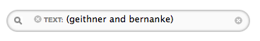
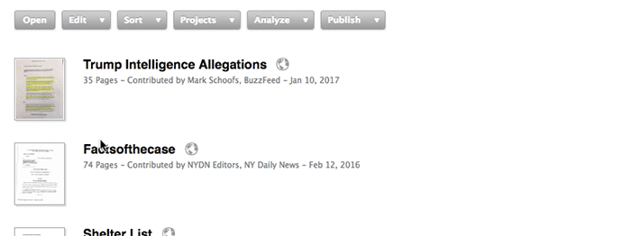

# Searching for Documents
By default, a search looks for **all of the words you enter within the title and full text of the document itself**. For example: John Yoo detainee. You can, however, ask DocumentCloud to search the contents of specific fields.
## Advanced Queries

#### To search for a specific, multi-word phrase
Enclose terms in quotes.

#### To group searches (search for two keywords at once)
Use **and** and **or** and enclose your search in parentheses.

#### To exclude a keyword from a search
Use an exclamation point.

#### "Wildcard" searches
Wildcard searches enable you to query for incomplete keywords. For example, a search of `"J* Brown"` will match both `"Jerry Brown"` and `"John Brown"`.

## Searching by Built-in Metadata Field

**In addition to the above, you can use a whole host of filters to further refine your document searches.** You can filter documents by title, source, access, description, and more. 

You may also use **multiple filters** as once, as seen below:

#### Metadata Filters
Below is a list of all the filters you may use and what they mean.

**TERM**|**DESCRIPTION**
:-----:|:-----:
title|Will search for documents by title as provided by the person who uploaded it. For example: title: deepwater.
source|When you upload a document, you have the opportunity to identify the source. This provides a way to search that field. For example: source: supreme will identify documents attributed to "U.S. Supreme Court" as well as "New York State Supreme Court."
description|Search for a word or phrase within a document's description. For example: description: manifesto.
account|Specify an account id to see documents uploaded by a single user. Click on the toggle triangle in the top left corner of the "Documents" tab to reveal a list of all the accounts in your organization. For example: account: 7-scott-klein.
group|If you know the short name of an organization, you can search for documents uploaded by anyone in that newsroom. For example: group: chicago-tribune. You can also filter by clicking on the organization's name in the document list.
project|Restrict your search to just the documents in one of your projects by entering the title. This is the same as clicking on the project in the "Documents" tab.
projectid|Restrict your search to a particular project by a project's canonical identifier. Useful for filtering public API calls. You can view this ID by opening the project's edit dialog. For example: projectid: 6-the-financial-crisis
access|Search for only documents that have a particular access level (one of "public," "private," or "organization"). For example, to view all of your private documents: access: private
filter|Filter documents by interesting criteria (one of "published," "unpublished," "annotated," or "popular"). For example, to view all published documents: filter: published

## Viewing Entities

#### What Are Entities?
**Entities** are the people, places, organizations, terms, e.t.c. present in your documents. Whenever you upload a document to DocumentCloud we send the contents to **OpenCalais**[LINK], a service that discovers the entities present in plain text. 

[NOTE]OpenCalais can tell us that "Barack Obama" is the same person as "President Obama," "Senator Obama," "Mr. President" ... and even "he" or "his" in clauses such as "his policy proposals."[/NOTE]

#### To View All the Entities in a Document
1. **Right-click** on the document thumbnail.
2. Select **"View Entities"**.
3. Below your document will appear a list of the most frequent entities in the document. The **grey tick marks** show where in the document each entity was mentioned.
    
4. **Mouse over** each tick mark to view a snippet of text from that entity mention.
    

## Editing and Searching your own Custom Data

**DocumentCloud allows you to define and search your own set of custom data (key/value pairs) associated with specific documents.**

To get started with document data, you can use the API [LINK] to add data to your documents in bulk — useful if you already have an existing database of information about your documents.

#### To edit data for individual documents:

To edit data for individual documents in the workspace, select the documents you wish to update, and choose Edit Document Data from the Edit menu ... or right-click on a document, and choose Edit Document Data from the context menu.

1. **Right-click** on the documents to which you want to add custom data.
2. Select **"Edit Document Data"**.
    
3. Input **key/value pairs** to describe your document. You can add or delete fields by clicking the plus and minus buttons to the right of the input fields.
    
4. Select **"Save"**.
5. Your custom key/value pair will now show up boxed underneath the document title, as shown below:

#### To search/filter using custom data:

After you add custom data fields to your documents, you will be able to search and filter your documents according to the custom key/value pairs you just created.

* **To filter all your documents by a key/value pair**, you can **select** the boxed key/value pair under any document. 

* You can also input the key/value pair in the regular search bar along with any other search terms, custom or not.

* You can enter the same key multiple times with different values for an "or" search. 

* If you'd like to filter all documents with a citizen key, but you don't care about the value, you can use: `citizen: *`

* To find all the documents that don't have a citizen key yet, use: `citizen: !`

